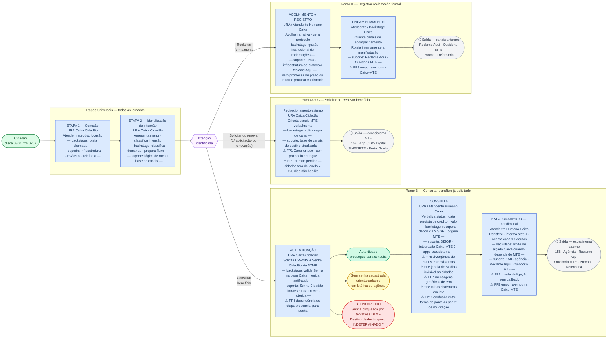

# Diagrama AS-IS
## Atendimento ao Seguro-Desemprego pela URA da Caixa Econômica Federal

### Legenda de estilos

| Estilo do nó | Significado |
|---|---|
| Azul | Etapa frontstage — URA ou Atendente Humano Caixa |
| Verde | Ponto de entrada / autenticação bem-sucedida |
| Vermelho | Fail point crítico (★) |
| Amarelo | Desfecho intermediário — senha ausente ou sem resolução |
| Cinza | Nó de saída (⬡) — cidadão deixa o escopo da URA Caixa |
| Roxo | Ponto de bifurcação de intenção |
| `— backstage —` | Processo operacional invisível ao cidadão |
| `— suporte —` | Infraestrutura técnica/operacional da etapa |
| ⚠ FPN | Fail point N (referência cruzada com `C_blueprint_asis.md`) |
| ? | Ponto em aberto — requer validação empírica |

---

---

### Relações estruturais destacadas pelo diagrama

| Relação | O que o diagrama torna visível |
|---|---|
| **URA como ator único nas etapas universais** | As duas etapas de entrada são inteiramente operadas pela URA — o atendente humano só aparece a partir do Ramo B (consulta) e Ramo D (reclamação) |
| **Canal errado como fail point de entrada** | O Ramo A+C termina imediatamente em saída — a URA não tem capacidade resolutiva para a intenção mais frequente (solicitar o benefício) |
| **Autenticação como gargalo do Ramo B** | O nó de autenticação se ramifica em três saídas, uma delas crítica e com destino indeterminado — qualquer problema aqui bloqueia todo o ramo B |
| **Concentração de fail points na consulta** | Quatro fail points (FP5, FP6, FP7, FP8) se acumulam em uma única etapa — a consulta é o maior núcleo de risco do canal após a autenticação |
| **Escalonamento como antecâmara de saída** | O escalonamento não resolve — é estruturalmente uma transição para saída do canal, com risco adicional de queda de chamada antes de completar essa transição |
| **Backstage MTE como origem invisível** | Os dados verbalizados na consulta têm origem MTE (SISGR), mas a integração tem mecanismo indeterminado — a divergência de status (FP5) é sistêmica, não acidental |
| **Saídas sem protocolo nos Ramos A+C** | Ao contrário do Ramo D (que gera protocolo), os cidadãos redirecionados nos Ramos A e C saem sem nenhum artefato de continuidade |

---

### Tabela RACI — Responsabilidades e interações entre atores

> **Referência cruzada:** esta tabela também está disponível em `C_blueprint_asis.md` — seção "Tabela RACI", consolidada com os demais elementos do blueprint.

**Legenda:** R = Responsável (executa) · A = Aprovador/Autoridade (responde pelo resultado) · C = Consultado (fornece informação) · I = Informado (recebe o resultado)

| Etapa / Atividade | Cidadão | URA Caixa Cidadão | Atendente Humano Caixa | Backstage Caixa | MTE (externo) |
|---|---|---|---|---|---|
| **E1 — Atender a chamada e reproduzir locução** | I | **R/A** | — | I *(roteamento)* | — |
| **E2 — Apresentar menu e classificar intenção** | R *(seleciona opção)* | **R/A** | — | R *(classifica demanda)* | — |
| **A+C — Orientar redirecionamento para MTE** | I | **R/A** | — | C *(regra de canal)* | I *(recebe o cidadão)* |
| **B — Solicitar e validar credenciais (autenticação)** | R *(digita credenciais)* | **R** | — | **A** *(valida na base · aplica antifraude)* | — |
| **B — Verbalizar status, data e valor (consulta)** | I | R *(verbaliza via TTS)* | R *(complementa se acionado)* | **A** *(recupera dados via SISGR)* | **C** *(origem dos dados — SISGR/habilitação)* |
| **B — Transferir para atendente e orientar (escalonamento)** | I | R *(transfere)* | **R/A** *(atende · orienta · encaminha)* | C *(limite de alçada)* | I *(recebe casos sem alçada Caixa)* |
| **D — Acolher narrativa e gerar protocolo (registro)** | R *(narra ocorrência)* | R *(acolhe)* | **R/A** *(registra · gera protocolo)* | R *(gestão institucional de reclamações)* | I |
| **D — Orientar canais e rotear manifestação (encaminhamento)** | I | — | R *(orienta)* | **A** *(roteia internamente)* | I *(pode receber reclamo)* |

#### Síntese das responsabilidades por ator

**Cidadão**
Inicia e sustenta toda a jornada — seleciona intenção, fornece credenciais, narra ocorrência. Não tem visibilidade sobre backstage nem sobre a integração Caixa↔MTE. Quando o canal falha, o ônus de encontrar o canal correto recai sobre ele.

**URA Caixa Cidadão**
Ator dominante nas etapas universais e único responsável pelo frontstage dos Ramos A+C e da autenticação no Ramo B. Executa sem discernimento: não distingue contextos individuais além do que o sistema de backend entrega. Não tem autoridade para resolver demandas de solicitação/renovação — redireciona por design.

**Atendente Humano Caixa**
Entra apenas a partir do Ramo B (consulta) e no Ramo D (reclamação). É o único ator com capacidade de julgamento situacional no canal, mas opera com limite de alçada quando a causa-raiz é de responsabilidade do MTE (FP9). Responsável pela geração do protocolo de reclamação no Ramo D.

**Backstage Caixa**
Autoridade técnica sobre autenticação, consulta e gestão de reclamações. Depende dos dados do MTE para executar a consulta (SISGR), criando uma dependência de terceiro invisível ao cidadão. Responsável pela lógica antifraude que pode bloquear permanentemente o acesso remoto (★FP3).

**MTE (ator externo)**
Fonte de dados para todas as consultas do Ramo B e destino obrigatório para solicitação e renovação. Não tem presença direta no canal Caixa — atua como consultado passivo (fornece dados via SISGR) e como receptor dos cidadãos redirecionados. A integração Caixa↔MTE é o ponto cego de maior risco sistêmico do blueprint.
